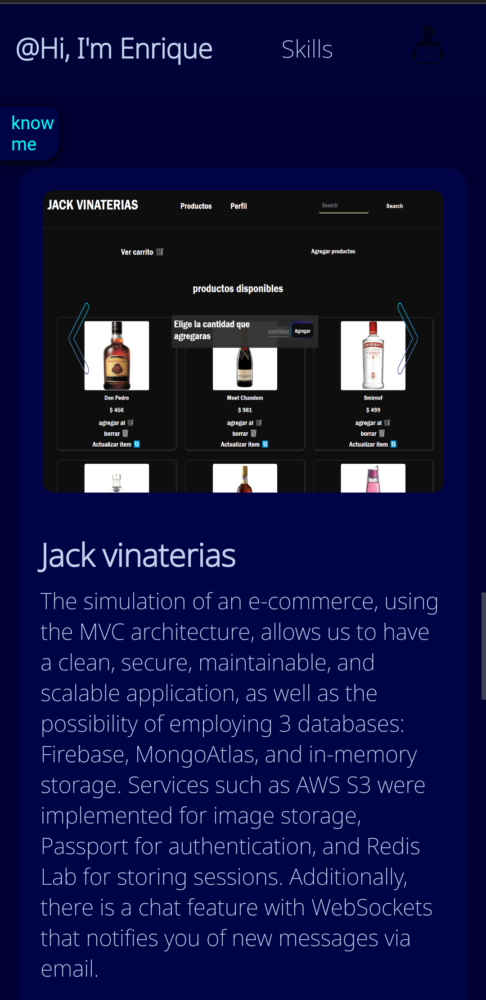
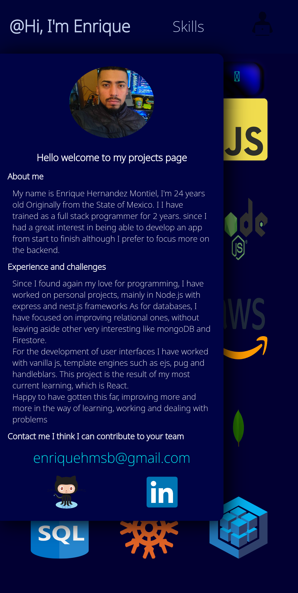
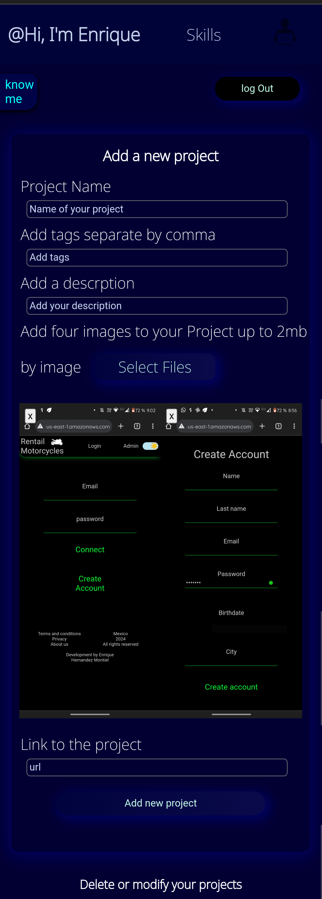

# Project briefcase

## INDEX

\*[Description](#Description)

\*[Learnigns](#Learnings)

\*[Functionalities](#Functionalities)

\*[Images](#Images)

## Description

Hello, this is the user interface of the web app where I organize all my projects.
I chose to work with React.js in order to develop a deeper understanding of the concepts related to this library, as it was one of the first projects where I implemented it.

## Learnings

Mainly understanding how projects are structured with React, generating multiple components for reusability or easier scalability and comprehension, creating components from arrays, form validation, props drilling, state lifting, and how the use of state and effect hooks affects child components.

## Functionalities

The communication with our backend is done through the API fetch. The application consists of only 3 pages: the first one is responsible for rendering my projects and presenting a card with my information, another one with images of my skills, and finally my administration panel where I can enter my unique credentials and log in.

In the administration panel, I can add projects through a validated form, which displays the previously selected images, and I can also modify or delete any of my projects. We implement Toastify and SweetAlert to add dynamic alerts.

In addition to implementing a fully responsive design using Sass.

## Images

